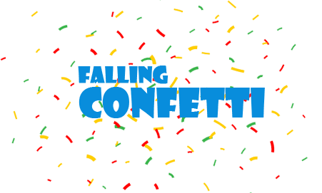

<h1 align="center">
    
</h1>

## 💻 Resumo do projeto

Uma animação simples (mas viciante) de confetes caindo

## 🛠 Tecnologias

#### Projeto foi construído utilizando **HTML** e CSS mas oq que é isso ?

- **HTML** ou HyperText Markup Language, que significa: "Linguagem de Marcação de Hipertexto" é uma linguagem de marcação utilizada na construção do "esqueleto" de páginas na Web.

- **CSS** ou Cascading Style Sheets é um mecanismo para adicionar estilo a um documento web.

## 🔨 Instalação Local

Você precisará do [GIT](https://git-scm.com/) na versão mais atualizada, instalado no seu computador para continuar.

```bash
$ cd falling-confetti
$ code .
```

E agora para rodar nossa animação localmente basta abrir o arquivo `index.html` e abrir com a extensão do **[Live Server](https://marketplace.visualstudio.com/items?itemName=ritwickdey.LiveServer)**

## 📖 License

Este projeto está sob a licença do MIT. Veja o arquivo [LICENSE](LICENSE.md) para mais detalhes.
